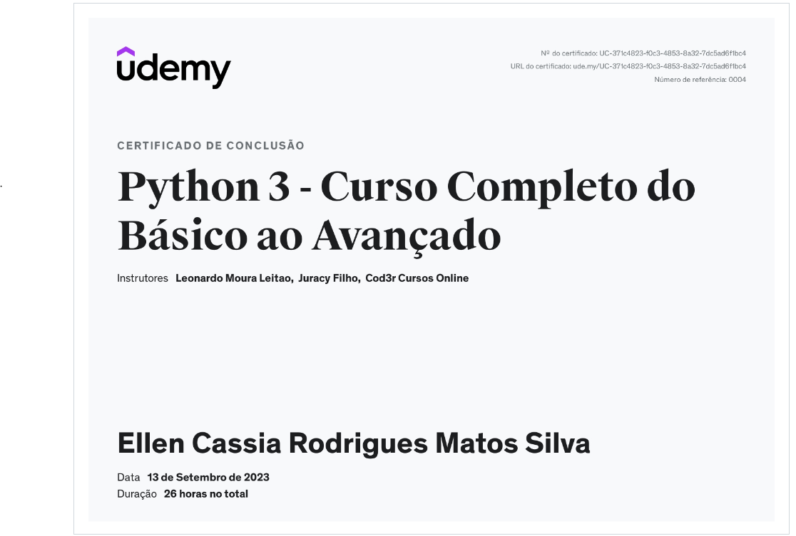
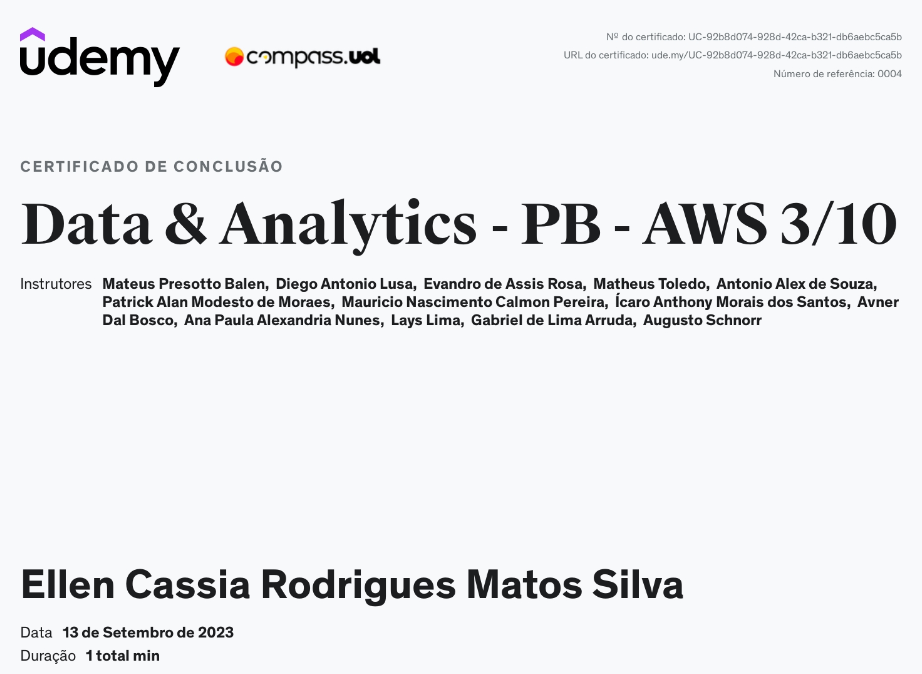

## 📕 Python 3 - Curso Completo do Básico ao Avançado

### 📑 Descrição
Objetivo: Aprenda do básico até o intermediário na Linguagem Python e compreenda diversos conceitos utilizados na área de de Data & Analytics.

### 🎉 Certificado 

### 📝 Data & Analytics - PB - AWS 3/10

Link dos desafios do curso: [desafios/sprint3](PYTHON-desafios)

Link dos desafios de ETL: [desafiosETL/sprint3](PYTHON-ETL%20desafios)