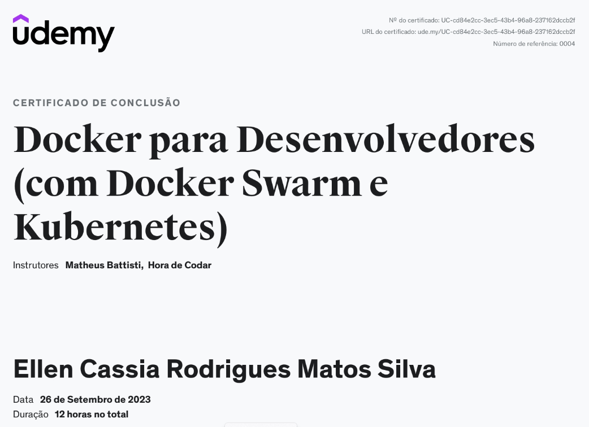
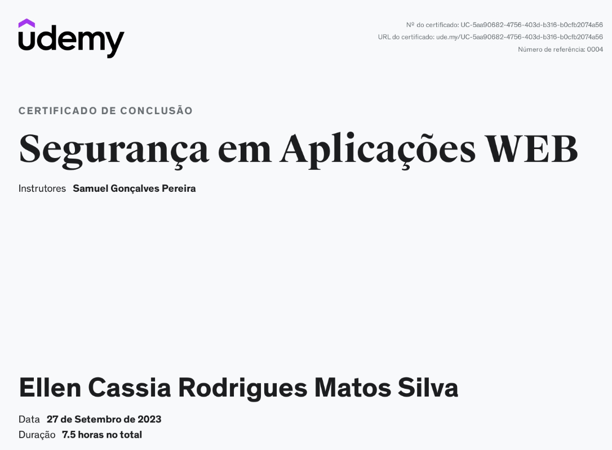

# 🚀 Relatório da Sprint 4 - Aprendizados

Nesta Sprint, tive a oportunidade de aprofundar meus conhecimentos em três áreas cruciais para o desenvolvimento de software: Docker para desenvolvedores, Segurança em Aplicações Web e Metodologias Ágeis. Embora já tivesse algum conhecimento prévio sobre Docker e Metodologias Ágeis, este curso me proporcionou uma compreensão mais profunda e abrangente. Aprendi muitos conceitos valiosos sobre Segurança em Aplicações Web, expandindo minha visão sobre a importância de proteger nossas aplicações. Abaixo, compartilho os principais pontos que adquiri em cada um desses cursos:

## 🐳 Docker para Desenvolvedores

- Antes do curso, eu já tinha uma noção básica de como o Docker funcionava, mas este curso me permitiu aprofundar meus conhecimentos.
- Aprendi a criar e gerenciar containers de maneira mais eficaz, o que é fundamental para o desenvolvimento e implantação de aplicativos.
- Entendi os conceitos de imagens, containers, volumes e redes no Docker e como usá-los em projetos reais.
- Aprendi a integrar o Docker em processos de desenvolvimento e implantação, tornando-o uma parte essencial do meu toolkit de desenvolvedor.

### 🎉 Certificado

## 🔒 Segurança em Aplicações Web

- Este curso ampliou significativamente minha compreensão sobre a importância da segurança em aplicações web.
- Aprendi sobre as principais ameaças e vulnerabilidades comuns em aplicações web, como injeções SQL, Cross-Site Scripting (XSS) e Cross-Site Request Forgery (CSRF).
- Descobri práticas recomendadas para proteger aplicações web, como validação de entrada, autenticação e autorização adequadas, e proteção contra ataques comuns.
- Adquiri conhecimento sobre ferramentas e técnicas de testes de segurança que posso aplicar em meus projetos para garantir que eles sejam mais resilientes a ameaças.

### 🎉 Certificado

## 🌀 Metodologias Ágeis

- Embora já estivesse familiarizado com os princípios do Agile, este curso me proporcionou uma compreensão mais profunda das diferentes metodologias ágeis, como Scrum, Kanban e Extreme Programming (XP).
- Aprendi a aplicar as práticas ágeis em projetos do início ao fim, incluindo planejamento, execução, revisão e melhoria contínua.
- Compreendi a importância da colaboração, comunicação e feedback constante em equipes ágeis e como esses aspectos contribuem para o sucesso do projeto.
- Adquiri habilidades práticas para gerenciar o backlog do projeto, conduzir reuniões de sprint e medir o progresso usando métricas ágeis.
### 🎉 Certificado

### 📕 Data & Analytics - PB - AWS 4/10

Link dos desafios do curso de Python: [desafiosPYTHON/sprint4](secao_2/)

Link dos desafios do curso de Docker: [desafiosDOCKER/sprint4](secao_3/)

## ✨ Conclusão Final 

Essa Sprint foi uma oportunidade valiosa para aprimorar minhas habilidades e conhecimentos nessas áreas essenciais para o desenvolvimento de software. Estou ansioso para aplicar o que aprendi em projetos futuros e continuar meu desenvolvimento profissional.

