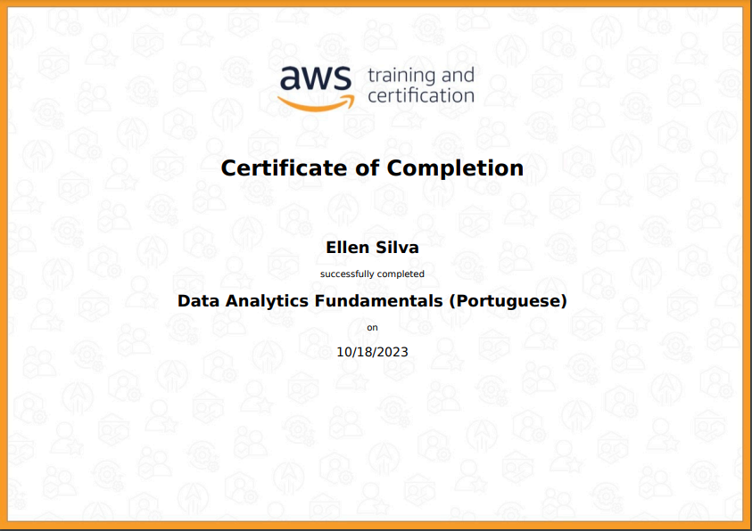
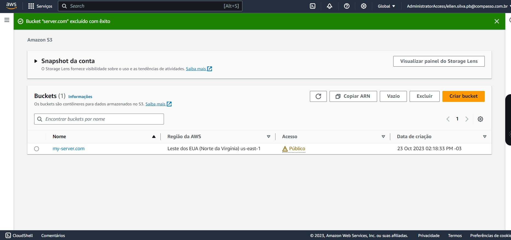
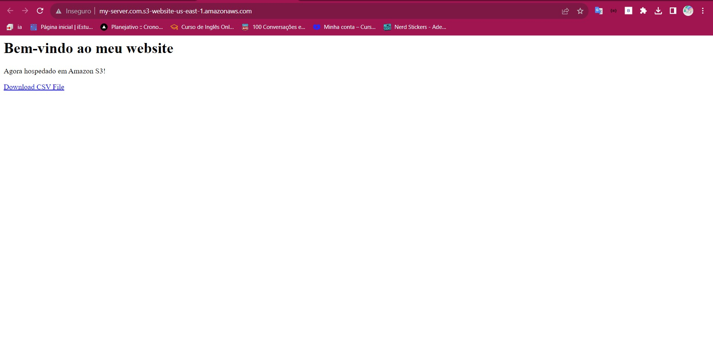
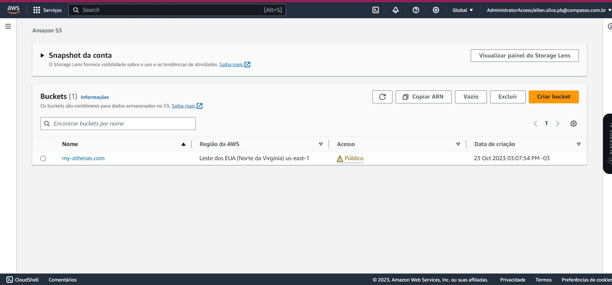
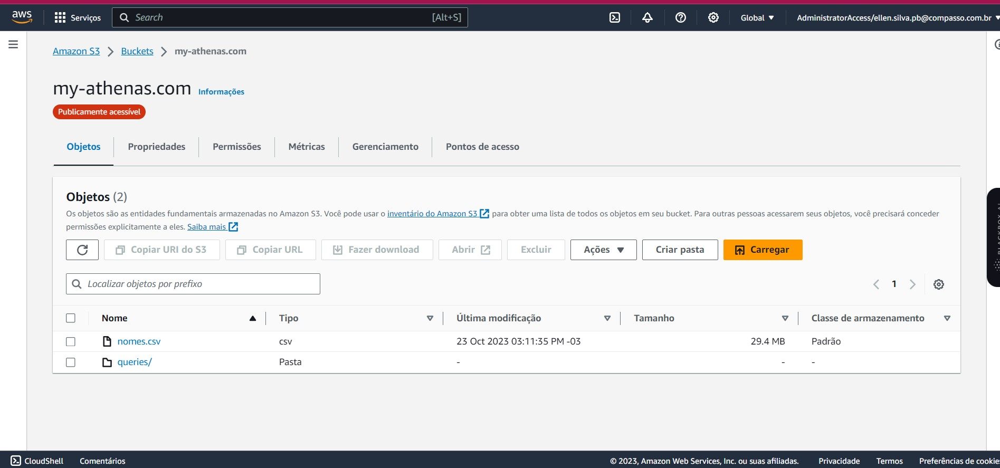
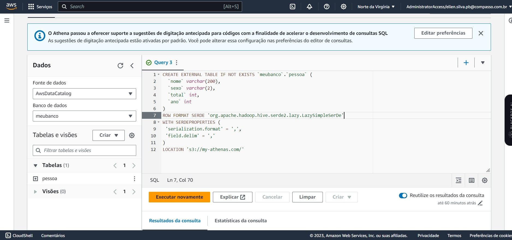
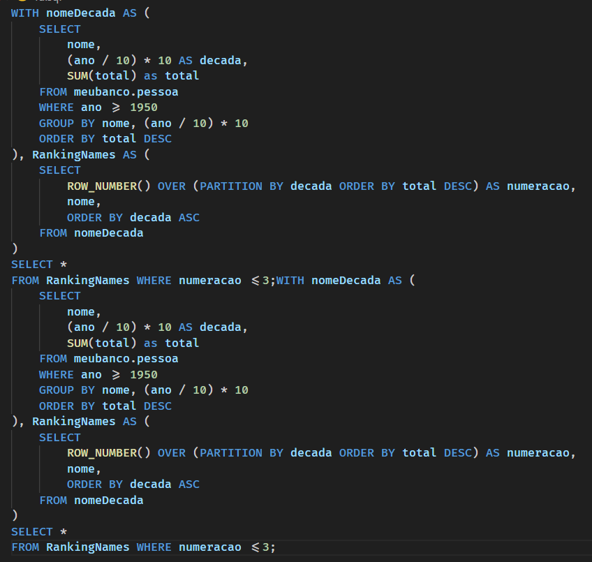
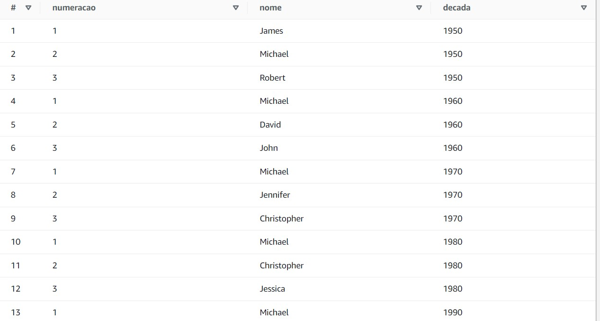

# 🚀 Aprendizado em Computação em Nuvem com a AWS

## Introdução
Bem-vindo à minha trilha de formação em Computação em Nuvem com a Amazon Web Services (AWS). Neste repositório, compartilho meu progresso e aprendizados em vários cursos e treinamentos relacionados à AWS e Computação em Nuvem.

## 📕 Cursos e Conteúdos
Aqui está uma visão geral dos cursos e conteúdos que explorei até agora:

### ☁️ AWS Skill Builder - Data Analytics Fundamentals (Portuguese)
- [Link para a documentação](AWS-DataAnalyticsFundamentals/README.md)
- Aprendi sobre os fundamentos da análise de dados, e como planejar as soluções de Data Analytics e como a AWS pode ajudar nesse processo.

#### 🎉 Certificado 

### ☁️ AWS Partner: Data Analytics on AWS (Business) (Portuguese)
- [Link para a documentação](AWS-DataAnalyticsOnAWS//README.md)
- Adquiri conhecimentos fundamentais sobre a AWS e os princípios da Computação em Nuvem.

### ☁️ AWS Skill Builder - AWS Partner: Aspectos econômicos da Cloud
- [Link para a documentação](AWS-PatherAspectosEconomicosDaCloud/README.md)
- Explorando a importância do valor comercial e do gerenciamento financeiro na nuvem.

#### 🎉 Certificado

### ☁️ AWS Skill Builder - AWS Partner: Accreditation (Technical) (Portuguese)
- [Link para a documentação]()
- Aprofundando meu conhecimento técnico em soluções da AWS.

#### 🎉 Certificado 

### ☁️ AWS Skill Builder - Exam Prep: AWS Certified Cloud Practitioner (Portuguese)
- [Link para a documentação](AWS-CertifiedCloudPractition/README.md)
- Preparando-me para o exame AWS Certified Cloud Practitioner.

#### 🎉 Certificado

# Data & Analytics - PB - AWS 6/10

## Lab AWS Athena

Criação do bucket S3

Adição do csv e index.html dentro do bucket S3

Bucket rodando na internet

### Configuração do Athena para a consulta SQL

Criação do bucket para armazenar os dados do arquivo csv

Adição do nomes.csv e uma pasta de queries para armazenar as consultas efetuada no athena

Criação do banco de dados no athena

Consulta para lista os 3 nomes mais usados em cada década desde o 1950 até hoje

Resultado na Consulta SQL

## Lab AWS Lambda

## ✨ Conclusão
Minha jornada de aprendizado em Computação em Nuvem com a AWS está em pleno andamento. Estou empolgado para aplicar esse conhecimento em projetos futuros e, eventualmente, obter a certificação AWS. 
