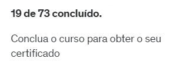
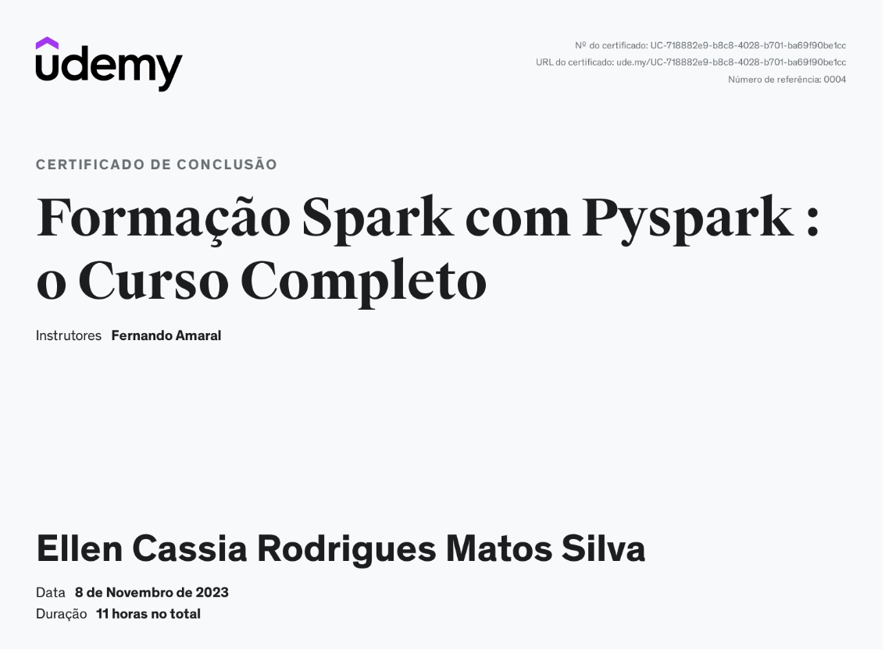
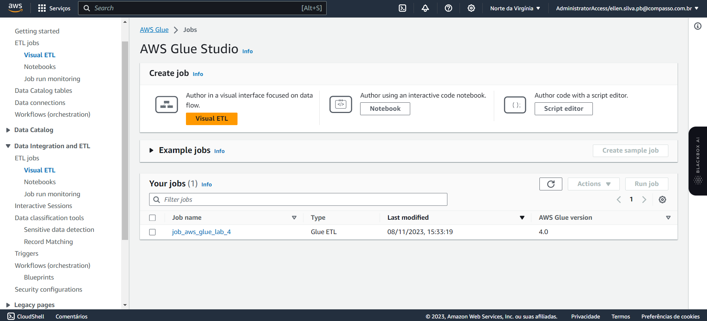
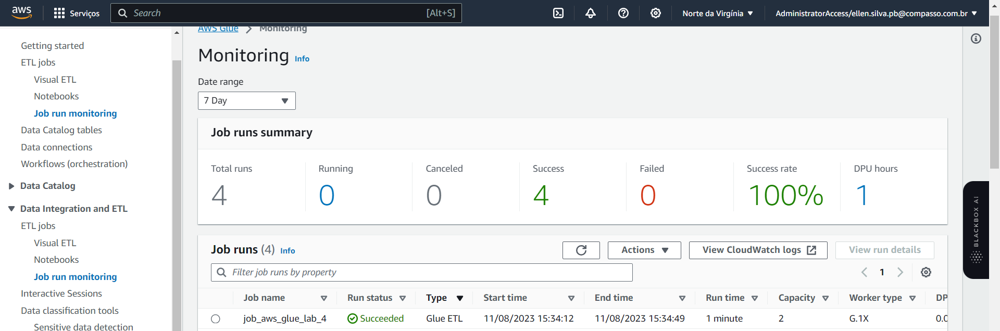
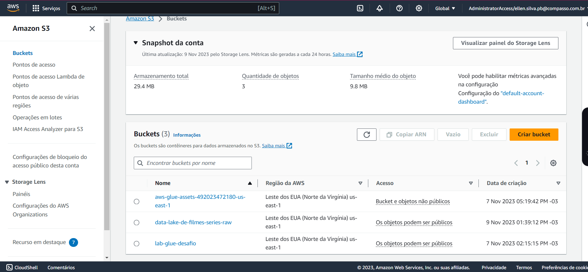
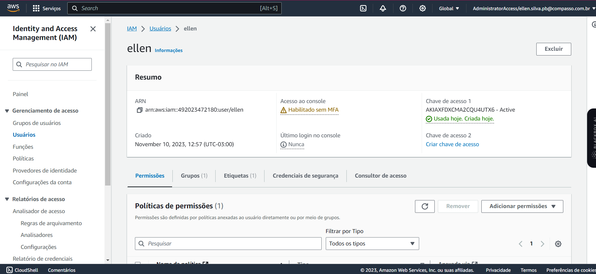

# 🚀 Aprendizado em Computação em Nuvem com a AWS

## Introdução
Bem-vindo à minha trilha de formação em Computação em Nuvem com a Amazon Web Services (AWS). Neste repositório, compartilho meu progresso e aprendizados em vários cursos e treinamentos relacionados à AWS e Computação em Nuvem.

## 📕 Cursos e Conteúdos
Aqui está uma visão geral dos cursos e conteúdos que explorei até agora:

### ☁️ AWS Skill Builder - Data Analytics Fundamentals (Portuguese)

- Aprendi sobre os fundamentos da análise de dados, e como planejar as soluções de Data Analytics e como a AWS pode ajudar nesse processo.

#### 🎉 Certificado 

### ☁️ AWS Partner: Data Analytics on AWS (Business) (Portuguese)

- Adquiri conhecimentos fundamentais sobre a AWS e os princípios da Computação em Nuvem.

### ☁️ AWS Skill Builder - Introduction to Amazon Kinesis Streams

- Explorando a importância do Amazon Kinesis Streams que é um serviço da Amazon Web Services (AWS) que permite a ingestão e o processamento de dados em tempo real. Ele é projetado para lidar com fluxos de dados de alta taxa e transmitir esses dados para aplicativos de processamento em tempo real.

#### 🎉 Certificado

### ☁️ AWS Skill Builder - Introduction to Amazon Athena
- Neste curso abordou uma brevê explicação sobre o conceito de Amazon Athena e porque ele é tão importante por sua capacidade de simplificar a análise de grandes volumes de dados no Amazon S3 sem a necessidade de configurar ou manter infraestrutura de banco de dados.

#### 🎉 Certificado 

### ☁️ AWS Skill Builder - Introduction to Amazon Kinesis Analytics

- Este curso me deu um entendimento sobre o Amazon Kinesis Analytics  é um serviço da Amazon Web Services (AWS) projetado para processar e analisar dados em tempo real a partir de streams de dados gerados por fontes como sensores, aplicativos e dispositivos IoT (Internet of Things). Ele fornece uma plataforma para a criação de consultas SQL em tempo real que permitem extrair informações valiosas dos fluxos de dados em tempo real.

#### 🎉 Certificado

### ☁️ AWS Skill Builder - Introduction to Amazon Quicksight (Portuguese)

- Amazon QuickSight é um serviço da Amazon Web Services (AWS) de análise de dados e geração de relatórios que permite aos usuários criar visualizações interativas e painéis de controle a partir de dados em tempo real. Ele é projetado para ajudar as empresas a tomar decisões baseadas em dados de forma mais eficaz, oferecendo uma plataforma intuitiva para análise de informações e compartilhamento de insights.

#### 🎉 Certificado

### ☁️ AWS Skill Builder - Introduction to AWS IoT Analytics

- Ele permite que as organizações extraiam insights valiosos a partir desses dados, criando pipelines de dados, aplicando análises e visualizando resultados, facilitando a tomada de decisões informadas no contexto da IoT.

#### 🎉 Certificado

### ☁️ AWS Skill Builder - Getting Started with Amazon Redshift

- Amazon Redshift é um serviço de data warehousing totalmente gerenciado pela Amazon Web Services (AWS) que oferece uma plataforma escalável para armazenar e analisar grandes volumes de dados. Ele é projetado para ajudar as empresas a executar consultas SQL complexas em dados de maneira rápida e eficiente, permitindo a análise de informações de forma mais aprofundada e o suporte a decisões baseadas em dados.

#### 🎉 Certificado

### ☁️ AWS Skill Builder - Deep Dive into Concepts and Tools for Analyzing Streaming Data

- Profundidade em Conceitos e Ferramentas para Análise de Dados em Streaming" refere-se a uma exploração detalhada das técnicas e ferramentas usadas na análise de dados em tempo real ou em fluxo contínuo. Isso envolve a compreensão de conceitos como processamento de eventos e o uso de ferramentas como Apache Kafka, Apache Flink e Apache Spark Streaming para analisar dados que chegam continuamente, permitindo tomar decisões ágeis com base em insights.

#### 🎉 Certificado

.png)

### ☁️ AWS Skill Builder - Best Practices for Data Warehousing with Amazon Redshift (Portuguese)

- Melhores Práticas para Data Warehousing com o Amazon Redshift" são diretrizes e estratégias recomendadas para o uso eficaz do Amazon Redshift, um serviço de data warehousing da Amazon Web Services (AWS). Essas práticas ajudam a otimizar o desempenho, a segurança e a escalabilidade do Redshift, permitindo que as organizações processem e analisem dados de maneira mais eficiente e confiável.

#### 🎉 Certificado

.png)

### ☁️ AWS Skill Builder - Serverless Analytics (Portuguese)

- Análise sem servidor" refere-se a uma abordagem de análise de dados que não requer gerenciamento de infraestrutura de servidores. É uma prática que envolve o uso de serviços em nuvem para coletar, processar e analisar dados, permitindo que as organizações se concentrem na análise de informações em vez de lidar com a manutenção de servidores. É uma maneira eficiente de realizar análises de dados na nuvem, proporcionando escalabilidade e redução de custos.

#### 🎉 Certificado

### ☁️ AWS Skill Builder - Why Analytics for Games (Portuguese)

- Para avaliar as tendências na frequência e nos tipos de erros do jogo ao longo do tempo, à medida que você lança novas versões, a solução de análise em lote (horas ou mais) é mais adequada. A análise em lote é ideal para processar grandes volumes de dados históricos e permite que você analise dados coletados ao longo do tempo de maneira mais abrangente. Isso oferece uma visão mais completa das tendências e padrões de erros à medida que novas versões do jogo são lançadas. A análise em tempo real é mais apropriada para situações que exigem respostas imediatas, mas para avaliações de tendências ao longo do tempo, a análise em lote é mais eficaz.

#### 🎉 Certificado

# Data & Analytics - PB - AWS 6/10

## Lab AWS Athena

Criação do bucket S3

Adição do csv e index.html dentro do bucket S3

Bucket rodando na internet

### Configuração do Athena para a consulta SQL

Criação do bucket para armazenar os dados do arquivo csv

Adição do nomes.csv e uma pasta de queries para armazenar as consultas efetuada no athena

Criação do banco de dados no athena

Consulta para lista os 3 nomes mais usados em cada década desde o 1950 até hoje

Resultado na Consulta SQL

## Lab AWS Lambda

## ✨ Conclusão
Minha jornada de aprendizado em Computação em Nuvem com a AWS está em pleno andamento. Estou empolgado para aplicar esse conhecimento em projetos futuros e, eventualmente, obter a certificação AWS. 
