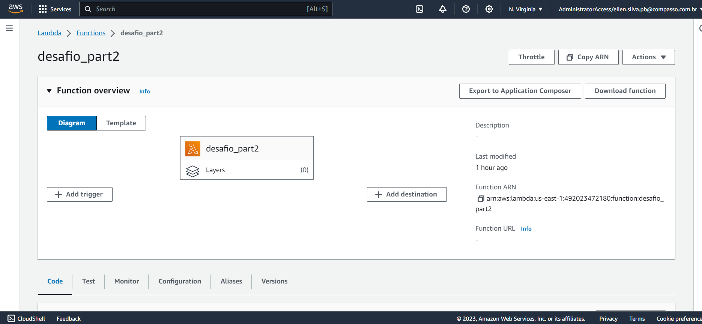
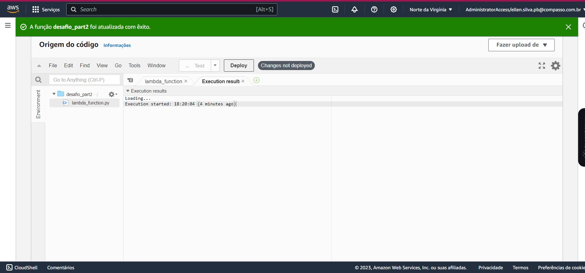
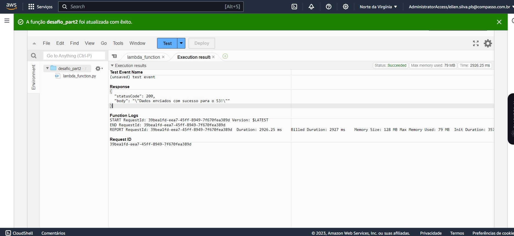
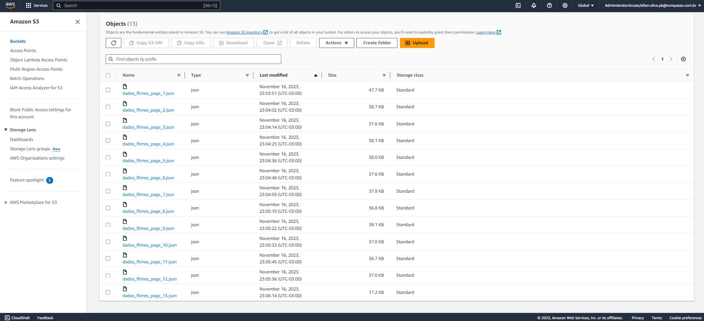
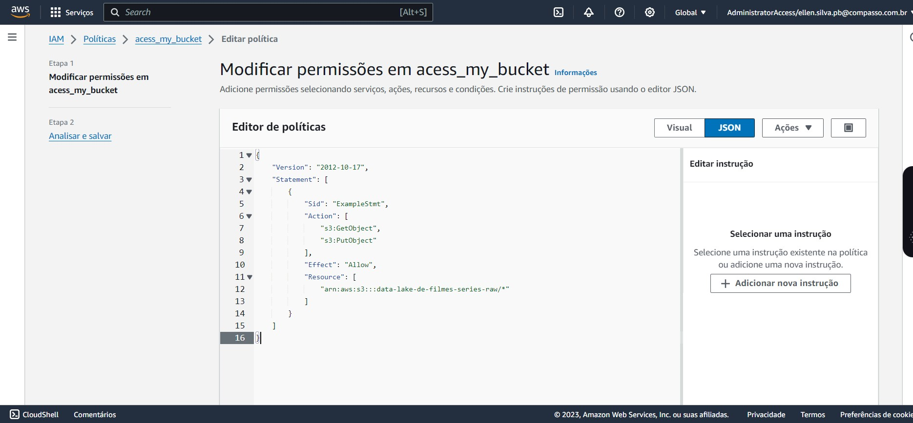
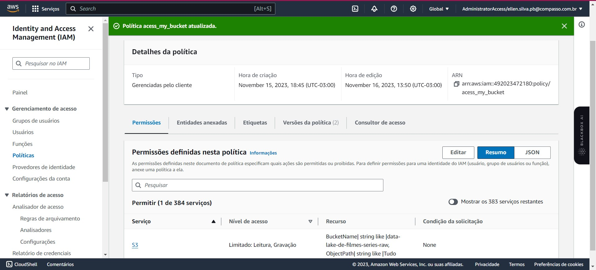
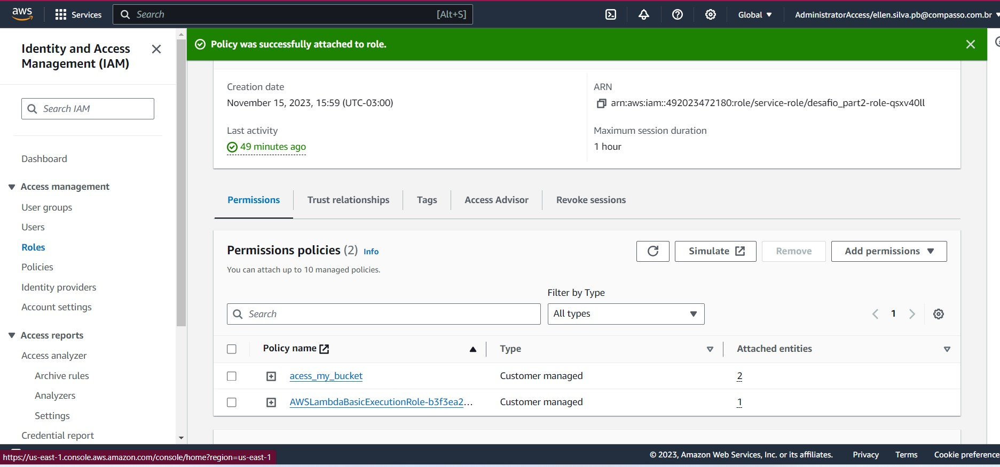

Criando uma função lambda

Executando o script na lambda

Resultado da executação do código

Arquivos de json salvos no bucket 

Criando uma policy de acesso para o bucket

Criada a policy de acesso

Adicionado a roles do lambda a permissão criada acima

