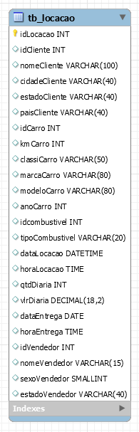
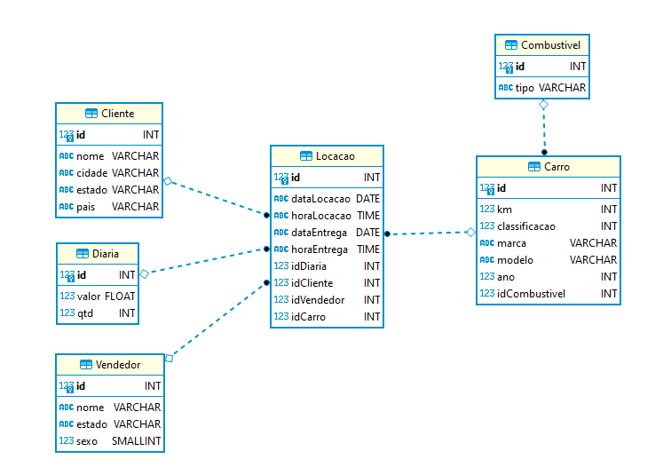
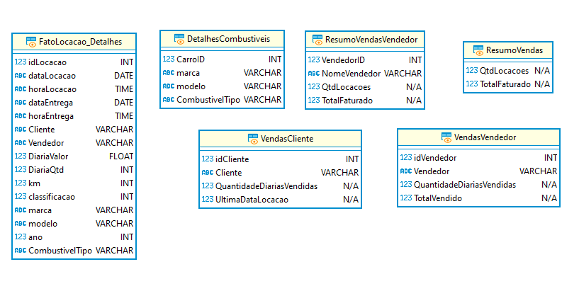
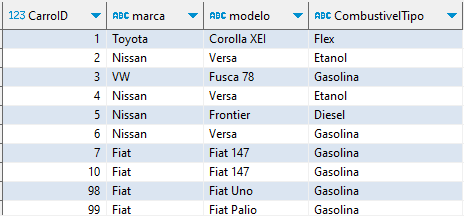
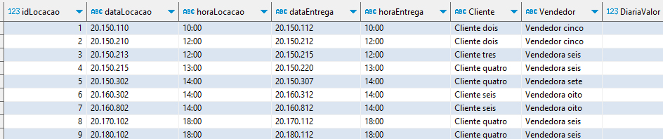
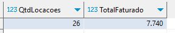
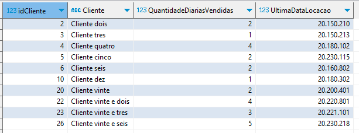
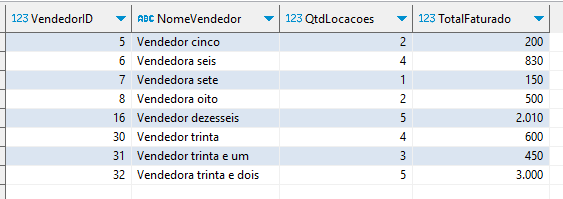

# 📕Processo de Normalização e Dimensionalização dos dados de concessionária

Este README explica o processo de normalização e dimensionalização aplicado ao dados desta atividade. Essas etapas visam melhorar a eficiência, a integridade e o desempenho dos dados passados.

## Normalização

A normalização é o processo de organização das tabelas de um banco de dados para reduzir redundâncias e dependências. Nesta atividade, a normalização foi aplicada da seguinte maneira:

### Modelo Lógico

Em primeiro lugar, para representar as entidades e os relacionamentos, foi elaborado um Diagrama de Classes com base na primeira representação gráfica abaixo:

Antes:

Depois:

### Modelo Físico 

Após a criação do modelo físico, procedemos à criação das tabelas e à transferência dos dados da tabela tb_locacao para suas respectivas entidades:

#### Tabelas criadas:

- Cliente
- Vendedor
- Locacao
- Combustivel
- Carro
- Diaria

Segue o arquivo SQL do modelo físico: [Modelo Físico](Tarefa1-ModelagemRelacional)

## Dimensionalização

A dimensionalização é uma técnica essencial em data warehousing, visando modelar os dados de maneira a facilitar análises e a geração de relatórios eficientes. Abaixo, apresentamos uma explicação detalhada das práticas de dimensionalização adotadas, bem como exemplos específicos de implementação.

### Modelo Lógico

### Dimensões

As tabelas de dimensões foram criadas para oferecer uma visão detalhada das entidades envolvidas no contexto das locações.

Exemplificamos com a criação da tabela DetalhesCombustiveis, que fornece informações específicas sobre carros e os tipos de combustíveis associados.

### Fatos

A tabela de fatos FatoLocacao_Detalhes oferece um histórico detalhado de todas as locações, consolidando informações relevantes. Essa tabela é central para análises que necessitam de dados detalhados sobre locações, clientes, vendedores, diárias, carros e combustíveis.

### Granularidade

A granularidade escolhida para as tabelas de dimensões e fatos foi cuidadosamente definida para atender às necessidades analíticas. Por exemplo, a tabela ResumoVendas resume a quantidade de locações e o total faturado, proporcionando uma visão agregada dessas informações.

### VendasCliente

A view VendasCliente fornece insights sobre as transações dos clientes, incluindo a quantidade de locações feitas por cada cliente e a data da última locação.

### VendasVendedor

A view VendasVendedor resume as informações de vendas para cada vendedor, incluindo a quantidade de locações vendidas e a receita total gerada.

Segue o arquivo SQL do modelo dimensional: [Modelo Dimensional](Tarefa2-ModelagemDimensional)

## Conclusão

Este README fornece uma visão geral do processo de normalização, modelagem relacional e seus conceitos associados no contexto dos dados passados na atividade. 